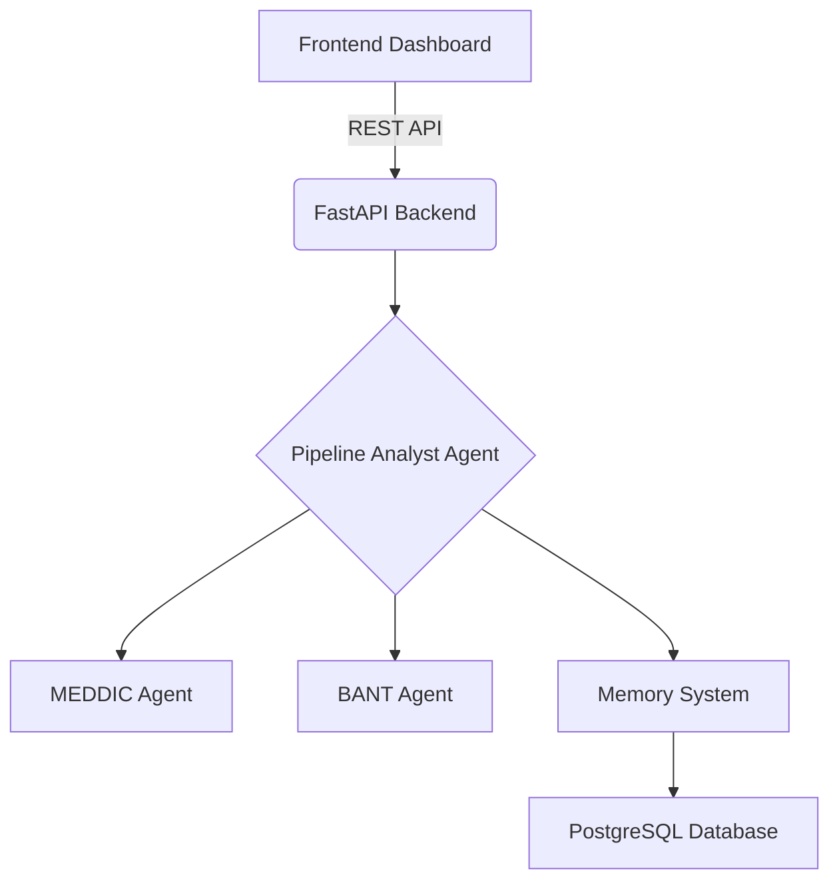

# Sales Pipeline Intelligence Platform

This repository contains the source code for a sales pipeline analysis tool. The platform leverages a multi-agent system to analyze CRM data, score deals against established sales frameworks, and provide data-driven recommendations. The system is designed for self-hosting to ensure data privacy and can be integrated with various CRMs and LLMs.

---

## Table of Contents

- [Core Features](#core-features)
- [System Architecture](#system-architecture)
- [Technology Stack](#technology-stack)
- [Local Development Setup](#local-development-setup)
- [API Usage](#api-usage)
- [Agent Learning Mechanism](#agent-learning-mechanism)
- [Configuration](#configuration)
- [Deployment](#deployment)
- [Contributing](#contributing)
- [License](#license)

---

## Core Features

- **Framework-Based Deal Analysis**: Scores deals against standard sales methodologies, including MEDDIC (Metrics, Economic Buyer, Decision Criteria, Decision Process, Pain, Champion) and BANT (Budget, Authority, Need, Timeline).
- **Memory-Powered Learning**: Utilizes a dual-memory system (episodic and semantic) to learn from past deal outcomes and improve the quality of its recommendations over time.
- **Predictive Analytics**: Can be integrated with a machine learning backend (like MindsDB) to forecast win probability and time-to-close.
- **Proactive Alerting**: Identifies stalled deals or emerging risks and can be configured to send alerts.
- **CRM Integration**: Designed to connect with CRMs like HubSpot and Salesforce via an integration layer (e.g., Composio) to pull deal data.
- **Model Agnosticism**: Compatible with any OpenAI-compatible LLM API, allowing users to choose between cloud-hosted models (GPT-4o, Claude 3.5) or self-hosted models (Llama 3, Mixtral) for privacy.

---

## System Architecture

The platform is composed of a frontend dashboard, a FastAPI backend, and a PostgreSQL database. The backend contains the core agentic system.



1.  **Frontend**: A user interface for viewing deal analysis and interacting with the system.
2.  **FastAPI Backend**: Exposes the agentic system via a REST API.
3.  **Pipeline Analyst Agent**: The main orchestrator agent that implements a `perceive -> plan -> act -> reflect` loop to manage the analysis process.
4.  **Specialized Agents**: Agents like `MEDDICAgent` and `BANTAgent` are responsible for executing analysis based on a single, specific framework.
5.  **Memory System**: Persists interactions and learned patterns to the database.
6.  **PostgreSQL Database**: Stores deal data, agent interactions (episodic memory), and learned rules (semantic memory).

---

## Technology Stack

| Component | Technology |
| :--- | :--- |
| **Backend** | FastAPI, Python 3.11 |
| **Database** | PostgreSQL 16, pgvector |
| **Agents** | Custom Python classes |
| **Deployment** | Docker, Docker Compose |
| **ML Backend** | MindsDB (Optional) |
| **Integrations**| Composio (Optional) |

---

## Local Development Setup

### Prerequisites

- Docker and Docker Compose
- An API key for an OpenAI-compatible LLM provider

### 1. Configuration

Clone the repository and create a `.env` file from the example:

```bash
git clone https://github.com/MouhamedN96/Sales-Pipeline-Intelligence.git
cd Sales-Pipeline-Intelligence

cp .env.example .env
```

Open the `.env` file and add your database password and LLM API key:

```env
DB_PASSWORD=your_secure_password
OPENAI_API_KEY=sk-your-openai-key
LLM_MODEL=gpt-4o
```

### 2. Start Services

Run the following command to build and start all services:

```bash
docker-compose up -d
```

This command will provision:
- A PostgreSQL database on port `5432`.
- The FastAPI backend on port `8000`.
- A placeholder frontend service on port `3000`.

### 3. Verify Setup

- **API Documentation**: [http://localhost:8000/docs](http://localhost:8000/docs)
- **Health Check**: [http://localhost:8000/health](http://localhost:8000/health)

---

## API Usage

### Analyze a Deal

Send a `POST` request to `/api/deals/analyze` to trigger a full analysis.

**Request:**
```bash
curl -X POST http://localhost:8000/api/deals/analyze \
  -H "Content-Type: application/json" \
  -d 
    "deal_id": "deal_123",
    "deal_name": "Acme Corp - Enterprise Plan",
    "company_name": "Acme Corp",
    "deal_value": 50000,
    "stage": "negotiation",
    "owner_email": "sales@example.com",
    "raw_data": {
      "notes": "Customer needs solution for 100 users. Budget approved. Talking to VP of Sales.",
      "last_contact": "2025-01-15"
    }
  }
```

**Response:**
The API returns a JSON object containing the MEDDIC score, prioritized recommendations, and any alerts or learned insights.

### Retrieve Deal History

Fetch the episodic memory (interaction history) for a specific deal.

```bash
curl http://localhost:8000/api/deals/deal_123/history?limit=5
```

### Retrieve Learned Patterns

Fetch the semantic memory (generalized rules) learned by the agent.

```bash
curl http://localhost:8000/api/patterns?context=negotiation&min_confidence=0.5
```

---

## Agent Learning Mechanism

The agent's ability to learn is based on a dual-memory architecture:

1.  **Episodic Memory**: Stores every interaction with a deal as a discrete event in the `deal_interactions` table. This includes the context, the action taken by the agent, the outcome, and any user feedback. This provides a historical record of specific experiences.

2.  **Semantic Memory**: Stores generalized patterns learned across all deals in the `deal_patterns` table. These patterns are derived from aggregating episodic memories. For example, by observing many deals, the agent can learn that "Deals with an internal champion close 85% of the time."

This two-part system allows the agent to improve its performance over time by using specific past experiences to refine its general understanding of what works.

---

## Configuration

### LLM Models

The platform is model-agnostic. The LLM can be configured in the `.env` file. The following providers are supported out-of-the-box:

```env
# OpenAI
LLM_MODEL=gpt-4o

# Anthropic
# LLM_MODEL=anthropic/claude-3-5-sonnet-20240620

# Self-hosted via Ollama
# LLM_MODEL=ollama/llama3
```

### Sales Frameworks

Frameworks can be enabled or disabled during the `PipelineAnalystAgent` initialization in `apps/agent-os/main.py`.

---

## Deployment

For a production environment, it is recommended to:

1.  Use a managed database service (e.g., AWS RDS, Google Cloud SQL).
2.  Deploy the backend and frontend services as containers (e.g., on AWS ECS, Google Cloud Run, or Kubernetes).
3.  Implement a robust authentication layer (e.g., Clerk, Auth0).
4.  Configure monitoring and logging (e.g., Prometheus, Grafana).

---

## Contributing

Contributions are welcome. Please follow the standard fork-and-pull-request workflow.

1.  Fork the repository.
2.  Create a new branch (`git checkout -b feature/your-feature`).
3.  Commit your changes (`git commit -am 'Add new feature'`).
4.  Push to the branch (`git push origin feature/your-feature`).
5.  Create a new Pull Request.

---

## License

This project is licensed under the MIT License. See the [LICENSE](LICENSE) file for details.
